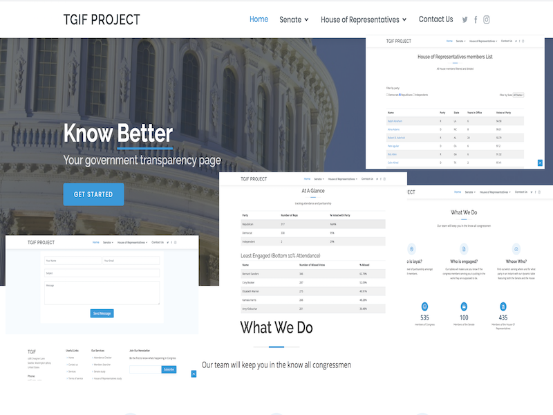

<!--
*** Thanks for checking out the Best-README-Template. If you have a suggestion
*** that would make this better, please fork the repo and create a pull request
*** or simply open an issue with the tag "enhancement".
*** Thanks again! Now go create something AMAZING! :D
***
***
***
*** To avoid retyping too much info. Do a search and replace for the following:
*** jschof1, TGIF-Project, twitter_handle, jackschofield1@gmail.com, TGIF Project, find out more about US members congress. Get information about a congress members attendance, party loyalty and years in office in the most accessible way possible.
-->


<!-- PROJECT SHIELDS -->
<!--
*** I'm using markdown "reference style" links for readability.
*** Reference links are enclosed in brackets [ ] instead of parentheses ( ).
*** See the bottom of this document for the declaration of the reference variables
*** for contributors-url, forks-url, etc. This is an optional, concise syntax you may use.
*** https://www.markdownguide.org/basic-syntax/#reference-style-links
-->
[![Contributors][contributors-shield]][contributors-url]
[![Forks][forks-shield]][forks-url]
[![Stargazers][stars-shield]][stars-url]
[![Issues][issues-shield]][issues-url]
[![MIT License][license-shield]][license-url]
[![LinkedIn][linkedin-shield]][linkedin-url]


<!-- PROJECT LOGO -->
<br />
<p align="center">
  <a href="https://github.com/jschof1/TGIF-Project">
    
  </a>

  <p align="center">
    Find out more about US congress members. Get information about a congress members attendance, party loyalty and years in office in the most accessible way possible. Updated live through 
    <br />
    <a href="https://github.com/jschof1/TGIF-Project"><strong>Explore the docs »</strong></a>
    <br />
    <br />
    <a href="https://github.com/jschof1/TGIF-Project">View Demo</a>
    ·
    <a href="https://github.com/jschof1/TGIF-Project/issues">Report Bug</a>
    ·
    <a href="https://github.com/jschof1/TGIF-Project/issues">Request Feature</a>
  </p>
</p>


<!-- TABLE OF CONTENTS -->
<details open="open">
  <summary><h2 style="display: inline-block">Table of Contents</h2></summary>
  <ol>
    <li>
      <a href="#about-the-project">About The Project</a>
      <ul>
        <li><a href="#built-with">Built With</a></li>
      </ul>
    </li>
    <li>
      <a href="#getting-started">Getting Started</a>
      <ul>
        <li><a href="#prerequisites">Prerequisites</a></li>
        <li><a href="#installation">Installation</a></li>
      </ul>
    </li>
    <li><a href="#usage">Usage</a></li>
    <li><a href="#roadmap">Roadmap</a></li>
    <li><a href="#contributing">Contributing</a></li>
    <li><a href="#license">License</a></li>
    <li><a href="#contact">Contact</a></li>
  </ol>
</details>


<!-- ABOUT THE PROJECT -->
## About The Project

 <a href="https://transparentgovinfact.netlify.app/">
    
  </a>

Here's a blank template to get started:
**To avoid retyping too much info. Do a search and replace with your text editor for the following:**
`jschof1`, `TGIF-Project`, `twitter_handle`, `jackschofield1@gmail.com`, `TGIF Project`, `find out more about US members congress. Get information about a congress members attendance, party loyalty and years in office in the most accessible way possible.`


### Built With

* [HTML](https://developer.mozilla.org/en-US/docs/Web/HTML)
* [CSS](https://developer.mozilla.org/en-US/docs/Web/CSS)
* [JavaScript](https://developer.mozilla.org/en-US/docs/Web/JavaScript)
* [Bootstrap](https://getbootstrap.com/)
* [jQuery](https://code.jquery.com/)


<!-- GETTING STARTED -->
## Getting Started

To get a local copy up and running follow: 

Clone the repo
   ```sh
   git clone https://github.com/jschof1/TGIF-Project.git
   ```

<!-- ROADMAP -->
## Roadmap

See the [open issues](https://github.com/jschof1/TGIF-Project/issues) for a list of proposed features (and known issues).


<!-- CONTRIBUTING -->
## Contributing

Contributions are what make the open source community such an amazing place to be learn, inspire, and create. Any contributions you make are **greatly appreciated**.

1. Fork the Project
2. Create your Feature Branch (`git checkout -b feature/AmazingFeature`)
3. Commit your Changes (`git commit -m 'Add some AmazingFeature'`)
4. Push to the Branch (`git push origin feature/AmazingFeature`)
5. Open a Pull Request


<!-- LICENSE -->
## License

Distributed under the MIT License. See `LICENSE` for more information.


<!-- CONTACT -->
## Contact

Jack Schofield - [My Linkedin](https://www.linkedin.com/in/jack-schofield-developer) - jackschofield1@gmail.com

Project Link: [https://transparentgovinfact.netlify.app/](https://transparentgovinfact.netlify.app/)


<!-- MARKDOWN LINKS & IMAGES -->
<!-- https://www.markdownguide.org/basic-syntax/#reference-style-links -->
[contributors-shield]: https://img.shields.io/github/contributors/jschof1/repo.svg?style=for-the-badge
[contributors-url]: https://github.com/jschof1/repo/graphs/contributors
[forks-shield]: https://img.shields.io/github/forks/jschof1/repo.svg?style=for-the-badge
[forks-url]: https://github.com/jschof1/repo/network/members
[stars-shield]: https://img.shields.io/github/stars/jschof1/repo.svg?style=for-the-badge
[stars-url]: https://github.com/jschof1/repo/stargazers
[issues-shield]: https://img.shields.io/github/issues/jschof1/repo.svg?style=for-the-badge
[issues-url]: https://github.com/jschof1/repo/issues
[license-shield]: https://img.shields.io/github/license/jschof1/repo.svg?style=for-the-badge
[license-url]: https://github.com/jschof1/repo/blob/master/LICENSE.txt
[linkedin-shield]: https://img.shields.io/badge/-LinkedIn-black.svg?style=for-the-badge&logo=linkedin&colorB=555
[linkedin-url]: https://linkedin.com/in/jschof1
